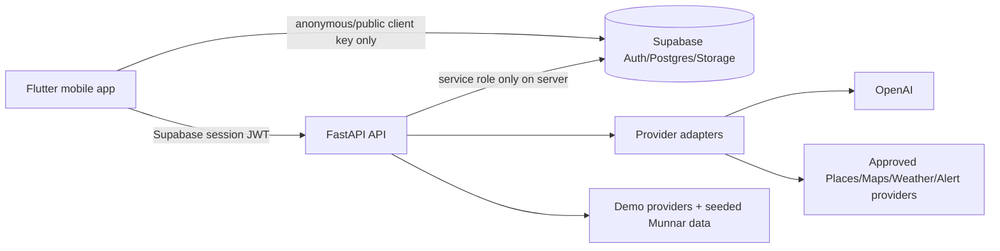

# Architecture

SMART TRIP separates UI, application API, provider adapters, and durable Supabase data:

The Flutter client never contains the Supabase service-role key, OpenAI key, or provider secrets. FastAPI validates the bearer session; Supabase RLS protects against an ID being changed on a direct database request.

## Provider boundaries

`TripPlanningService`, `RecommendationService`, `ReviewAnalysisService`, `ExpenseService`, `PhotoAIService`, `MagazineService`, `TravelAssistantService`, `SafetyService`, and the Flutter `MapProvider` are boundaries. Demo services are deterministic and disclose their status. A real provider replaces only the adapter and must return validated Pydantic/Dart models.

The recommendation score is transparent: rating (35), distance (up to 30), budget (15), category/preference (15), and safety (5). LLM output explains or summarizes permitted data but does not independently decide factual ranking.

Group travel uses `trip_members` plus trip-scoped RLS. The current demo offers a direct member identifier only to make a no-account SIH walkthrough possible; production must replace it with a verified, expiring invitation flow. Settlement balances are calculated from recorded payments and equal shares, with no payment transfer initiated by the app.

## Data and offline design

The Flutter app saves the active trip/session snapshot through `OfflineStatusService`; the visible offline banner warns that live data may be stale. A production release should add an encrypted local store for the full itinerary, recent expenses, contacts, timeline and photo thumbnails. Offline vector map packs must come from a licensed MapLibre-compatible provider selected in config; no OSM public tiles are downloaded or cached.

## Security boundaries

- Supabase Auth owns authentication and refresh-token handling in real mode.
- API endpoints validate access then verify trip ownership/membership.
- RLS repeats authorization on every table and private storage object.
- Production image URLs are signed/private, not public URLs.
- Structured logs include request ID, endpoint, status and latency—not passwords, API keys, private URLs, or GPS trails.
